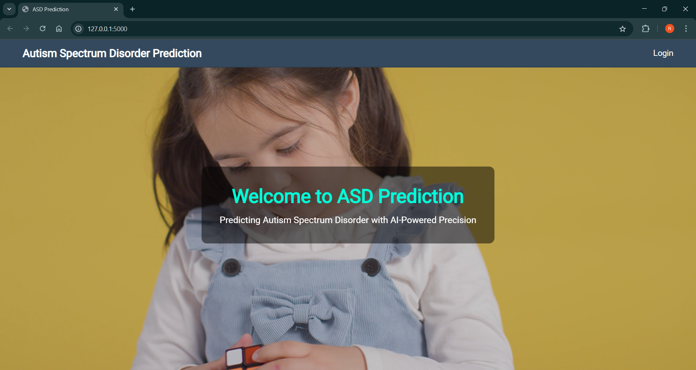
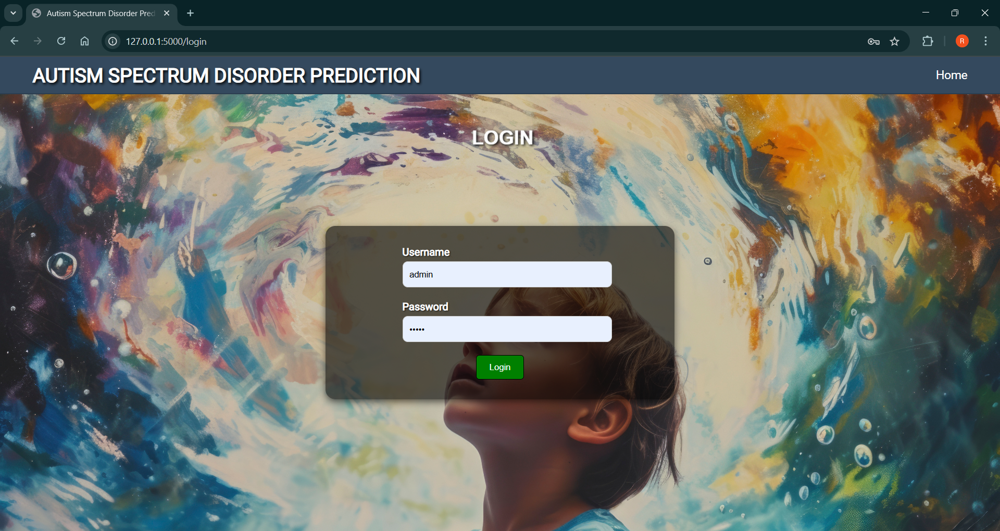
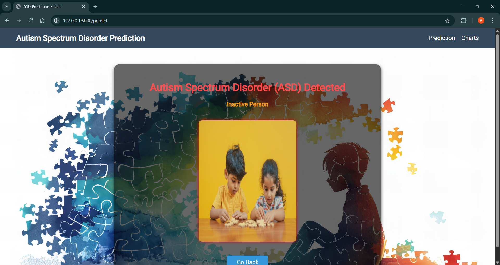

# 🧠 Autism Spectrum Disorder Diagnosis Prediction

This project predicts Autism Spectrum Disorder (ASD) in toddlers using machine learning techniques such as **Random Forest** and **SVM**. It includes a simple **Flask-based web interface** where users can input screening data and get real-time predictions.

---

## 📌 Project Highlights

- ✅ Data cleaning & preprocessing
- 📊 Feature selection
- 🌲 Random Forest & 🧮 SVM model training
- 🌐 Flask-based web app with user input form
- 💾 Model deployment using `.pkl` files

---

## 🚀 Tech Stack

- Python
- Pandas, NumPy
- scikit-learn
- Flask
- HTML/CSS (for basic web UI)

---

## 📁 Folder Structure 
```

project/
│
├── model/
│   ├── rf\_model.pkl
│   └── svm\_model.pkl
│
├── templates/
│   └── index.html
│
├── app.py
├── dataset.csv
├── README.md
└── requirements.txt

````

---

## 🛠️ How to Run

1. Clone the repo:
   ```bash
   git clone https://github.com/rahulgodumala/Autism-Spectrum-Disorder-Diagnosis-Prediction-repo.git
   cd Autism-Spectrum-Disorder-Diagnosis-Prediction-repo
   ````

2. Install dependencies:

   ```bash
   pip install -r requirements.txt
   ````

3. Run the app:

   ```bash
   python app.py
   ````

4. Open browser:

   ```
    http://127.0.0.1:5000/
   ````


## 📌 Note

This project is for academic and educational purposes. It does not replace professional medical diagnosis.


## 🏠 Web App Home Page


### 🔐 Login Page


## 🧾 Input Form Screenshot


### 📤 Output Form



